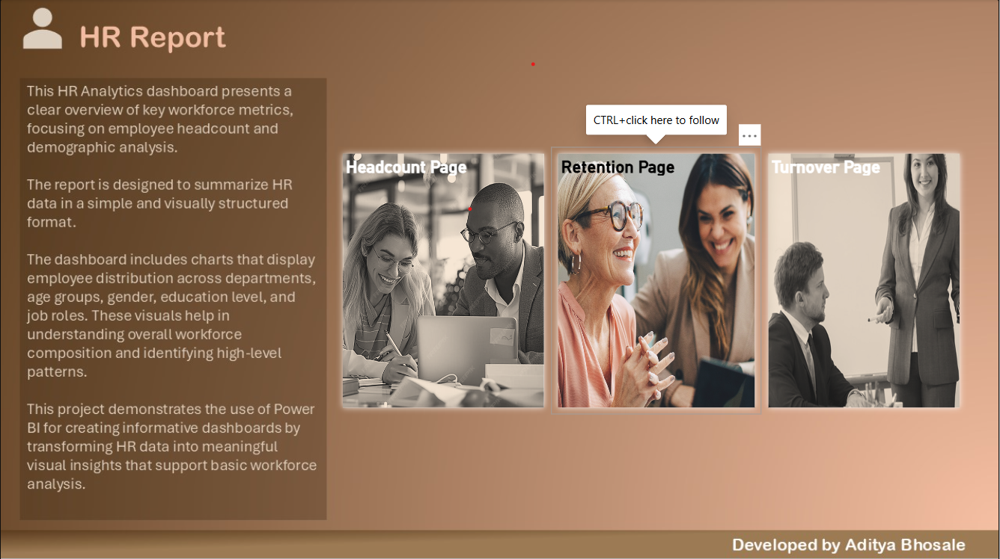
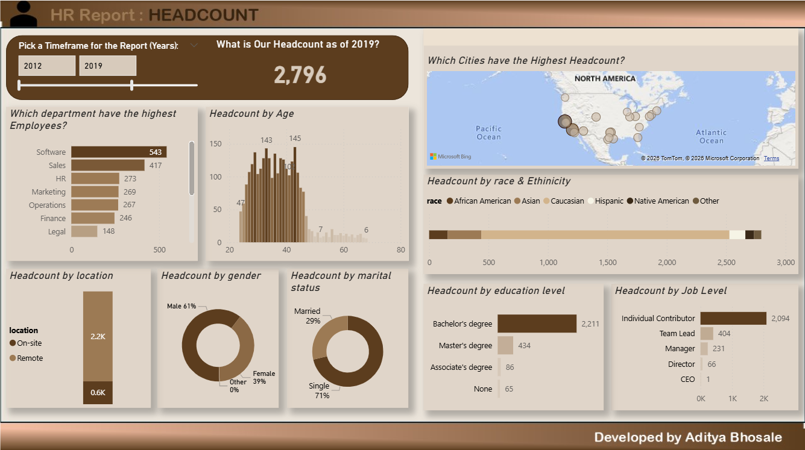
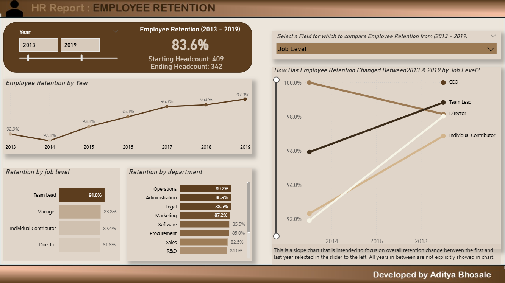
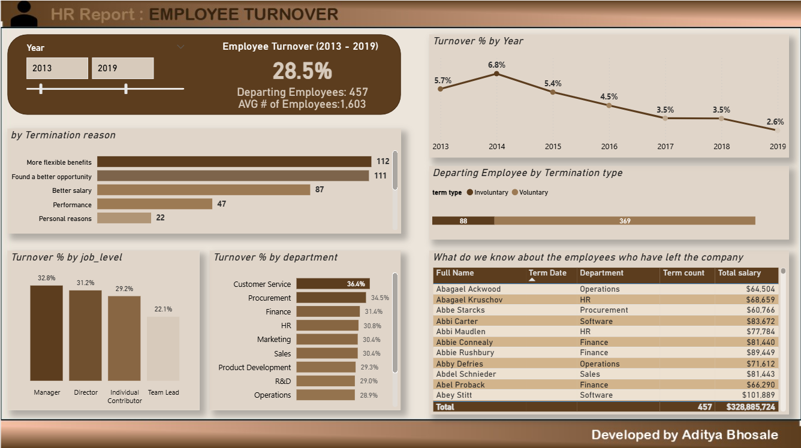

HR People Analytics Dashboard – Power BI
🔹 Project Overview

This HR People Analytics Dashboard was developed using Power BI to analyze workforce trends, focusing on headcount, employee retention, and turnover patterns. The dashboard provides actionable insights to support HR decision-making and workforce planning.

🔹 Objective

Analyze employee headcount trends over time

Understand retention and stability across departments

Identify turnover and attrition patterns

Enable data-driven HR strategies

🔹 Tools & Technologies Used

Power BI Desktop – Visualization & UI

Power Query – Data cleaning & transformation

DAX (Data Analysis Expressions) – KPI measures

Interactive tooltips & navigation buttons

🔹 Key Features

Headcount trend analysis by department and time

Retention metrics (retention % & stability)

Turnover/Attrition Insights

Interactive filters, drill-throughs & custom tooltips

Custom UI design using Power BI & PowerPoint elements

🔹 Key DAX Measures

Total Headcount

Retention %

Turnover / Attrition %

Department Breakdown Metrics

Trend Analysis KPIs

HR People Analytics Dashboard – Power BI
🔹 Project Overview

This HR People Analytics Dashboard was developed using Power BI to analyze workforce trends, focusing on headcount, employee retention, and turnover patterns. The dashboard provides actionable insights to support HR decision-making and workforce planning.

🔹 Objective

Analyze employee headcount trends over time

Understand retention and stability across departments

Identify turnover and attrition patterns

Enable data-driven HR strategies

🔹 Tools & Technologies Used

Power BI Desktop – Visualization & UI

Power Query – Data cleaning & transformation

DAX (Data Analysis Expressions) – KPI measures

Interactive tooltips & navigation buttons

🔹 Key Features

Headcount trend analysis by department and time

Retention metrics (retention % & stability)

Turnover/Attrition Insights

Interactive filters, drill-throughs & custom tooltips

Custom UI design using Power BI & PowerPoint elements

🔹 Key DAX Measures

Total Headcount

Retention %

Turnover / Attrition %

Department Breakdown Metrics

🔹 Dashboard Preview
### 📌 Cover Page 

### 📌 Headcount Overview

### 📌 Retention Analysis

### 📌 Turnover Insights

🔹 Business Insights

High retention observed in certain departments

Identified specific turnover patterns across workforce segments

Headcount trending over time provides strategic HR insights

Turnover insights pinpoint departments needing attention

🚀 Skills Demonstrated

✔ HR Analytics using Power BI
✔ DAX measures for workforce KPIs
✔ Data modeling & visualization
✔ Custom UI design in Power BI
✔ Storytelling with data
